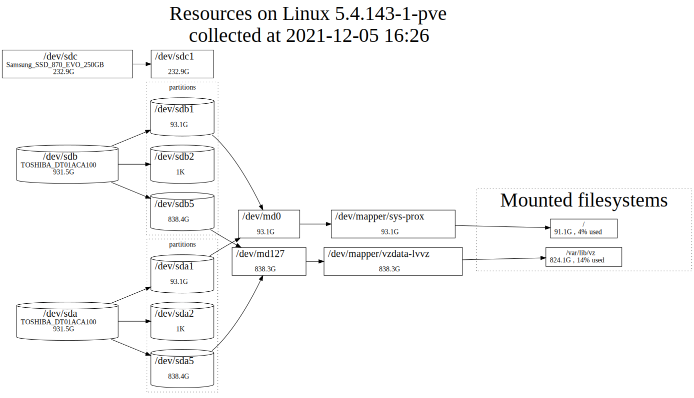
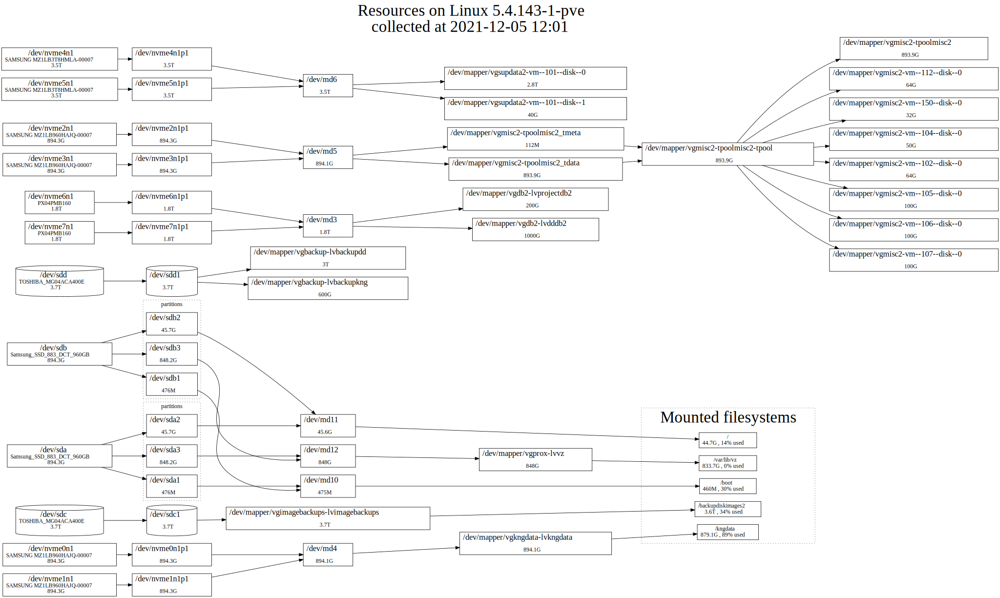

# Serverviz #

Inventory program for quick analize server infrastructure and produces [GraphViz](https://graphviz.org/) DOT format graph.
Using a large number of disks, partitions, virtual machines can easily get confused. So I wrote this program.

Currently display only disk, raid, LVM logical volumes and filesystem mounts.

Works with python2 and does need any depended packages installation. Simple download single file from github :

```curl https://raw.githubusercontent.com/pavlozt/serverviz/master/serverviz >serverviz ```

and run it (sudo  is necessary for the collection of information to work )

```sudo ./serverviz > server_graph.dot ```

To display DOT you must produce, for example pdf : 

``` dot -Tpdf server_graph.dot  > server_graph.pdf ```


Here is some example images:

or  more complex 12 disks server :



One of the programs which draw graphics from DOT online : [https://edotor.net/](https://edotor.net/)
